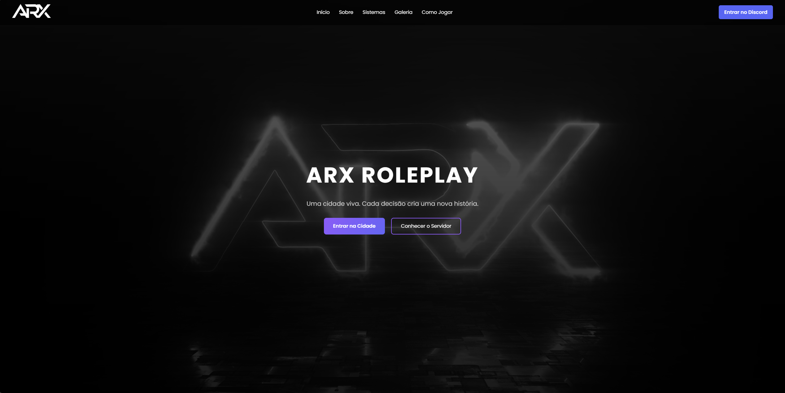

# 🌆 ARX Roleplay — Official Website

<p align="center">


</p>

<p align="center">

Website oficial do servidor **ARX Roleplay**.  
Desenvolvido para apresentar a cidade, aumentar a entrada de novos players e integrar o servidor com **Discord** e **FiveM**.

</p>

---

# 🖥️ Preview

<p align="center">



</p>

Estrutura principal do site:

```

Hero Section
↓
Trailer da Cidade
↓
Features da Cidade
↓
Facções / Trabalhos
↓
Como Entrar na Cidade
↓
Status do Servidor
↓
Status do Discord
↓
Call to Action

```

O design é inspirado em **grandes servidores de GTA RP**.

---

# 🚀 Tecnologias

Stack utilizada no projeto:

| Tecnologia | Uso |
|------------|------|
HTML5 | Estrutura do site |
CSS3 | Layout e animações |
JavaScript | Interações |
Discord API | Status do Discord |
FiveM API | Status do servidor |

---

# 📂 Estrutura do Projeto

```

arx-roleplay-site
│
├── index.html
│
├── css
│   └── style.css
│
├── js
│   └── discord.js
|   └── main.js
|   └── particles.js
|   └── server.js
│
├── assets
│   ├── imagens
│   ├── icons
│   ├── logo
│   └── videos
│
└── README.md

```

---

# ⚙️ Instalação Local

Para rodar o projeto localmente:

### 1️⃣ Clone o repositório

```

git clone [https://github.com/seuusuario/arx-roleplay-site.git](https://github.com/seuusuario/arx-roleplay-site.git)

```

### 2️⃣ Entre na pasta

```

cd arx-roleplay-site

```

### 3️⃣ Abra o projeto

Abra o arquivo:

```

index.html

```

em qualquer navegador.

---

# 🧱 Arquitetura do Projeto

Estrutura simplificada do funcionamento do site:

```

Usuário
│
▼
Frontend (HTML / CSS / JS)
│
├── Discord API
│
└── FiveM Server API

```

O site funciona como **hub central da cidade**, conectando jogador ao Discord e ao servidor.

---

# 🔗 Padrão de Links

Todos os links externos devem abrir em nova aba.

```
<a href="https://discord.gg/seulink" target="_blank" rel="noopener noreferrer">
Entrar no Discord
</a>
```

---

# 🎨 Padrões Visuais

Interface padronizada para melhor UX.

### Botões principais

```
Entrar na Cidade
Entrar no Discord
```

Todos possuem:

* animação hover
* transição suave
* feedback visual

---

# ⚡ Performance

Boas práticas implementadas:

✔ imagens otimizadas
✔ CSS centralizado
✔ JavaScript leve
✔ carregamento rápido

---

# 🗺️ Roadmap

## Versão 1.0

* [x] Estrutura base do site
* [x] Layout inicial
* [x] Vídeo da cidade
* [x] Integração Discord

---

## Versão 1.1

* [x] contador de players online
* [x] status do servidor FiveM
* [ ] preview do Discord

---

## Versão 2.0

* [ ] sistema de whitelist
* [ ] área de notícias
* [ ] painel de staff
* [ ] ranking de players

---

# 👨‍💻 Contribuindo

Quer ajudar no desenvolvimento?

### 1️⃣ Faça um fork

Clique em **Fork** no repositório.

---

### 2️⃣ Crie uma branch

```
git checkout -b feature/nova-feature
```

---

### 3️⃣ Faça commit

```
git commit -m "feat: adiciona nova seção ao site"
```

---

### 4️⃣ Envie para o repositório

```
git push origin feature/nova-feature
```

---

### 5️⃣ Abra um Pull Request

Descreva claramente a alteração feita.

---

# 🧾 Padrão de Commits

Utilizamos **Conventional Commits**.

| Tipo     | Uso                     |
| -------- | ----------------------- |
| feat     | nova funcionalidade     |
| fix      | correção de bug         |
| style    | mudanças visuais        |
| refactor | melhoria de código      |
| docs     | documentação            |
| perf     | melhoria de performance |

Exemplo:

```
feat: adiciona seção de facções
fix: corrige bug no menu mobile
style: melhora animação de botões
docs: atualiza README
```

---

# 🚀 Deploy

O site pode ser publicado facilmente em:

* GitHub Pages
* Netlify
* Vercel
* Cloudflare Pages

Exemplo usando **GitHub Pages**:

1. Vá em **Settings**
2. Clique em **Pages**
3. Escolha a branch **main**

O site ficará disponível em:

```
https://seuusuario.github.io/arx-roleplay-site
```

---

# 🔒 Boas Práticas

Antes de enviar código:

✔ manter padrão do projeto
✔ evitar código duplicado
✔ comentar partes complexas
✔ manter organização das pastas

---

# 🌐 ARX Roleplay

```
Entre na cidade.
Construa sua história.
Domine as ruas.
```

---

# 📢 Contato

Discord oficial:

```
https://discord.gg/Tw3AV8qJjy
```

---

# 📜 Licença

Projeto licenciado sob **MIT License**.